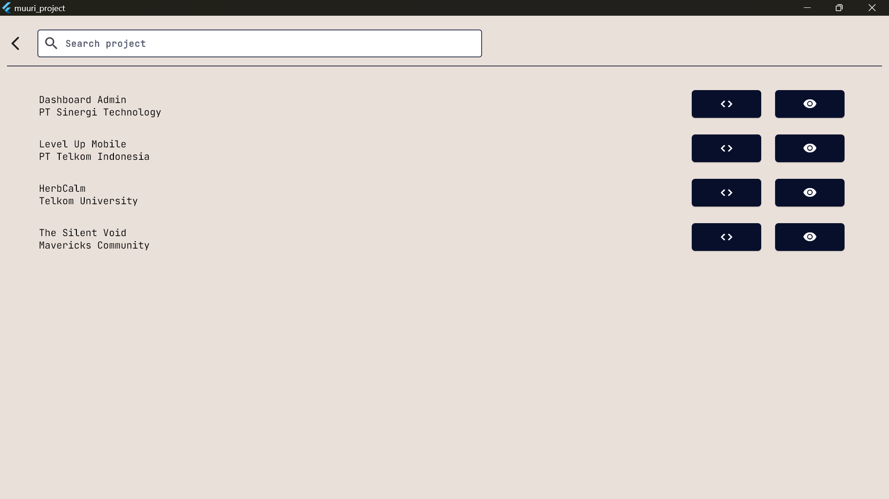

# Aplikasi Portofolio dengan Flutter

Ini adalah aplikasi portofolio yang dibangun menggunakan Flutter, memungkinkan pengguna untuk menampilkan karya-karya mereka dengan cara yang menarik dan interaktif.

## Fitur Utama
- **Tampilan Responsif:** Aplikasi ini dioptimalkan untuk berbagai ukuran layar, baik pada perangkat mobile maupun web.
- **Interaktif:** Portofolio menampilkan karya dengan visual yang menarik dan tata letak yang elegan.
- **Navigasi Mudah:** Pengguna dapat dengan mudah menjelajahi berbagai kategori portofolio melalui navigasi yang intuitif.

## Dokumentasi

Berikut adalah beberapa tangkapan layar dari aplikasi:

### Gambar 1


### Gambar 2


### Gambar 3


### Gambar 4


### Gambar 5


### Gambar 6


### Gambar 7


### Gambar 8


## Layout

Aplikasi ini menggunakan layout landscape untuk memberikan pengalaman visual yang lebih baik pada layar yang lebih lebar.

## Cara Memulai

1. Clone repository ini ke lokal Anda:
   ```
   git clone https://github.com/username/repository-name.git
   ```
2. Masuk ke direktori proyek:
   ```
   cd repository-name
   ```
3. Instal dependensi:
   ```
   flutter pub get
   ```
4. Jalankan aplikasi:
   ```
   flutter run
   ```

## Persyaratan

- Flutter SDK versi terbaru
- Dart SDK

## Kontribusi

Jika Anda ingin berkontribusi pada proyek ini, silakan fork repository ini dan ajukan pull request.

---
